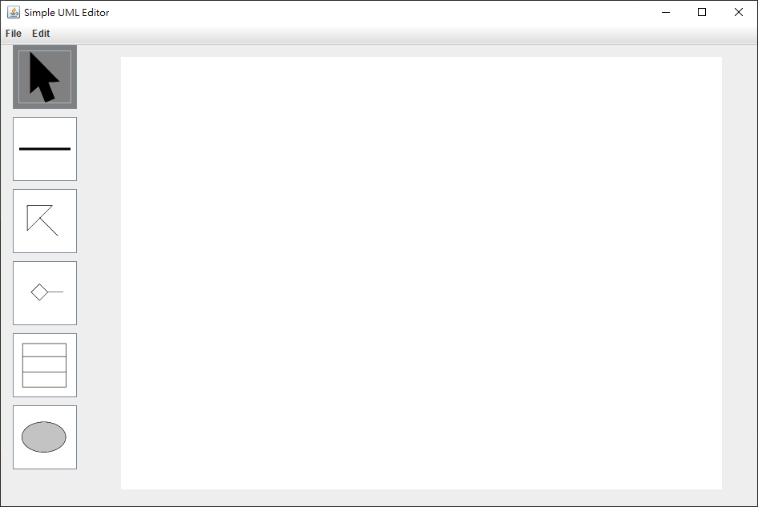

# UML-Editor
[](https://www.java.com)
[](https://travis-ci.org/dyhe83/UML-Editor)

一個簡單的 Java UML 編輯器

## How to use
```
$ git clone https://github.com/dyhe83/UML-Editor.git --depth=1
$ cd UML-Editor
$ ./gradlew run
```

## Screen shot

